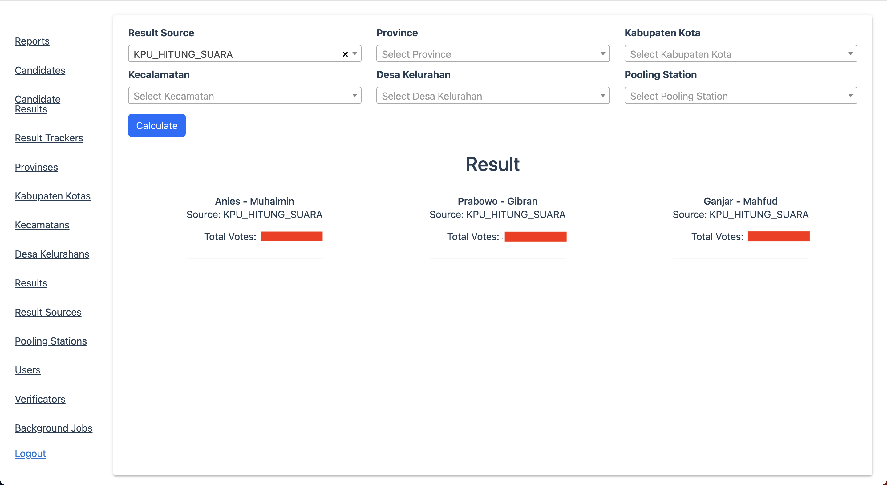

# Election Data Inspector

Election Data Inspector is a Ruby on Rails application designed to extract and analyze election data from any data source. The main data source is KPU Indonesia, but it can be extended to any other data source.

## Main Feature
1. Extract data from KPU Indonesia
2. Store JSON result from pooling station as historical in database
3. Admin dashboard 
4. Dashboard Count total votes every candidate with filter by region level
5. Corn job to extract data from data source

## Goals
1. Provide a tool that can extract election data from various sources and store into a MySQL database.
2. When data has been stored in a personal MySQL database, analyzing election data becomes easier with database queries.

## Technical Stack
1. Ruby on Rails
2. MySQL
3. Redis
4. Sidekiq
5. Administrate

## How to run
### Prerequisite
1. Ruby 3.1.1
2. Rails 7.0.8
3. MySQL
4. Redis

### Step
1. Clone this repository `git clone https://github.com/DienastyaGalih/election_data_inspector.git`
2. Make .env file and copy .env.example to .env
3. Fill the .env file with your configuration
4. Run `bundle install`
5. Run `rails db:create`
6. Run `rails db:migrate`
7. Run `rails db:seed`. This extract data region level from KPU Indonesia and store it into the database. This stage needs a long time to finish.
8. Run `rails s`
9. Run `bundle exec sidekiq`
10. Open `http://localhost:3000/admin` and login with seed user `user@example.com` and password `password`

## How to instant run job for extracting data from KPU Indonesia
1. Ensure that sidekiq is running
2. Open `http://localhost:3000/admin/monitoring/sidekiq/recurring-jobs`
3. Click `Enqueue Now` in section `generate_hitung_suara_kpu_president_job`
4. This job will generate all of total pooling station data in database. Around more than 800.000 data. https://pemilu.tempo.co/read/1835754/berapa-jumlah-tps-pemilu-2024-di-indonesia-ini-rinciannya

## How to run corn job for extracting data from KPU Indonesia
1. Ensure that sidekiq is running
2. Configure your corn job in .env file
3. Set value `CRON_GENERATE_HITUNG_SUARA_KPU_PRESIDENT_JOB='0 0 * * *'` this example every day in 00:00
4. Enable value `ENABLE_GENERATE_HITUNG_SUARA_KPU_PRESIDENT_JOB=true`

## How to monitor queue job
1. Open `http://localhost:3000/admin/monitoring/sidekiq/queues`
2. You can see the status of the job and the last time the job was run

## How to discuss and ask
1. Open issue in this repository
2. Follow this instruction if you don't know how to open issue https://docs.github.com/en/issues/tracking-your-work-with-issues/creating-an-issue

## How to code contribute
1. Fork this repository
2. Create a new branch
3. Make a pull request

## License
This project is licensed under the MIT License - see the [LICENSE.md](LICENSE.md) file for details
